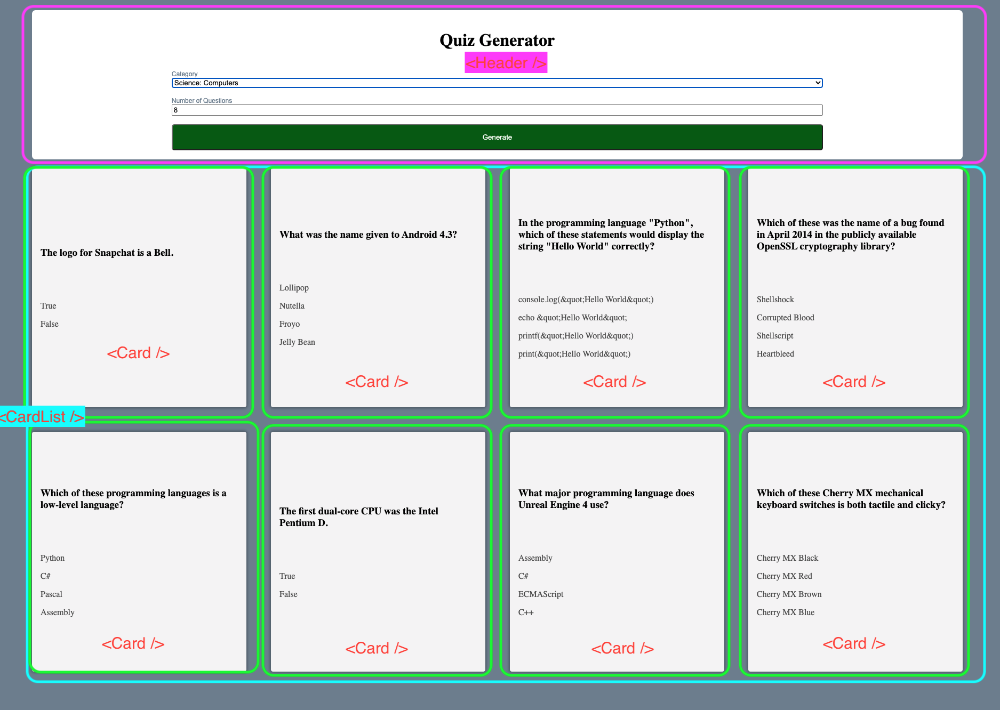

# Quiz Flip
[View Live Demo Here](https://fathomless-island-31213.herokuapp.com/)

## Project Details: 

### Thinking in React Components

  * The header would be a form that would allow for the user to select
  * Dynamic loading of categories from `www.opentdb.com` api using `useEffect()` and `fetch()` API
  * Async await function would be called to handle this asyncronous api call
  * The props would be hoisted in the App Component and would be up to the Header component to change:
  * `setState()` was an ideal use case and was passed as a prop from `<App />
  * form data was also used and was destructured within `handleInputChange()` method inside <Header />
  ```
    function handleInputChange({target}) {
   setForm({
     ...form,
     [target.name]: target.value
  }) 
  ```
  